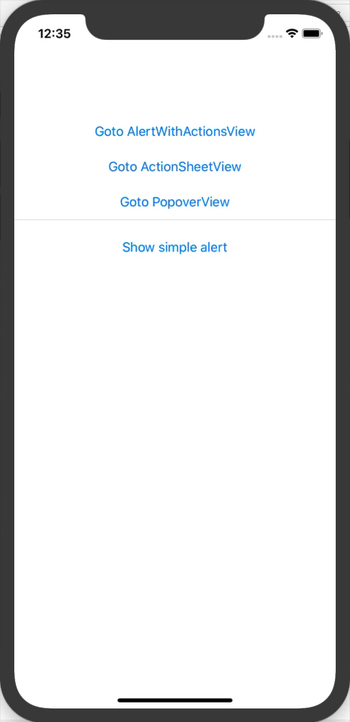

# SwiftUI-AlertDemo
## Using SwiftUI to display alerts, actionsheets and popovers
**(Updated for Xcode 11 Beta 5)**

In SwiftUI in order to display an **Alert** you need to define a bindable condition (e.g. a **@State** boolean) that determines whether 
the alert is visible or not. You attach the alert to the **View** using the **.alert** modifier which binds to the @State variable. 
The alert is presented when the bindable condition becomes true.

**ActionSheet**’s and **Popover**s are handled in a similar way using the **.actionSheet** and **.popover** modifiers.

The following demo shows:

* A simple **Alert**
* An **Alert** with **actions** (OK and Cancel buttons)
* An **ActionSheet**
* A **Popover**



___

Note that originally I had two .alert modifiers in one View, bound to different @State variables. I found that only the "last" alert was triggered.
I'm not sure if this is a bug (as of Xcode 11 Beta 5) or by-design behaviour. You can see some discussion on the topic on the SwiftUI forums
here: https://forums.swift.org/t/alert-problem-in-swiftui/27169.

___

## ContentView.swift
A simple **Alert**

``` swift
struct ContentView : View {
    @State private var showAlert = false
    
    var body: some View {
        NavigationView {
            VStack {
                NavigationLink(destination: AlertWithActionsView()) { Text("Goto AlertWithActionsView") }.padding(.bottom)
                NavigationLink(destination: ActionSheetView()) { Text("Goto ActionSheetView") }.padding(.bottom)
                NavigationLink(destination: PopoverView()) { Text("Goto PopoverView") }

                Divider()
                
                Button("Show simple alert") {
                    self.showAlert.toggle()
                }
                .padding(.all)
                
                Spacer()
                            
                .alert(isPresented: $showAlert) {
                    Alert(title: Text("Thanks"), message: Text("Thanks for tapping!"), dismissButton: .default(Text("OK")))
                }
            }
        }
    }
}
```

___

## AlertWithActionsView.swift
An **Alert** with **actions** (OK and Cancel buttons)

``` swift
struct AlertWithActionsView: View {
    @State private var showAlertWithActions = false
    @State private var messageText = "No message yet"
    
    var body: some View {
        VStack {
            Button("Show alert with actions") {
                self.showAlertWithActions.toggle()
            }
            .padding(.all)
                
            Text("Message: \(messageText)")
            .padding(.all)
            
            Spacer()
                
            .alert(isPresented: $showAlertWithActions) {
                Alert(title: Text("Thanks"),
                      message: Text("Say thanks?"),
                      primaryButton: .default(Text("OK")) { self.messageText = "Thank you :-)" },
                      secondaryButton: .cancel() { self.messageText = "Shame :-(" })
            }
        }
    }
}
```

___

## ActionSheetView.swift
An **ActionSheet**

``` swift
struct ActionSheetView: View {
    @State private var showActionSheet = false
    @State private var selectedFruit = "No fruit selected"

    var body: some View {
        VStack {
            Text(selectedFruit).padding(.all)
            
            Button("Show ActionSheet") {
                self.showActionSheet.toggle()
            }
            .padding(.all)
            
            Spacer()

            .actionSheet(isPresented: $showActionSheet) {
                ActionSheet(
                    title: Text("Fruit"),
                    message: Text("Select Fruit"),
                    buttons: [
                        .cancel { self.selectedFruit = "No fruit selected" },
                        .default(Text("Apple")) { self.selectedFruit = "Apple" },  // Create three default style buttons
                        .default(Text("Orange")) { self.selectedFruit = "Orange" },
                        .default(Text("Blueberry")) { self.selectedFruit = "Blueberry" }
                    ]
                )
            }
        }
    }
}
```

___

## PopoverView
A **Popover**

``` swift
struct PopoverView: View {
    @State private var showPopover = false

    var body: some View {
        VStack {
            Button("Show Popover") {
                self.showPopover.toggle()
            }
            .popover(isPresented: $showPopover, attachmentAnchor: .point(UnitPoint(x: 20, y: 20)), arrowEdge: .bottom) {
                Text("Hello! 👋")
            }
            
            // I would expect this to attach a 20x20 popover to the button. But it doesn't. Not sure if this is my
            // lack of understanding or a bug in SwiftUI
            
            Spacer()
        }
    }
}
```
